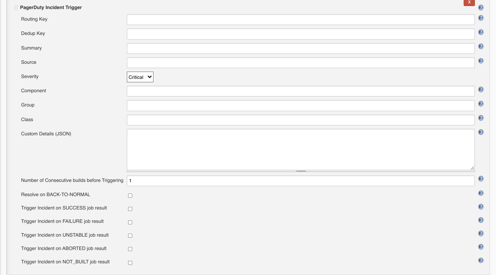
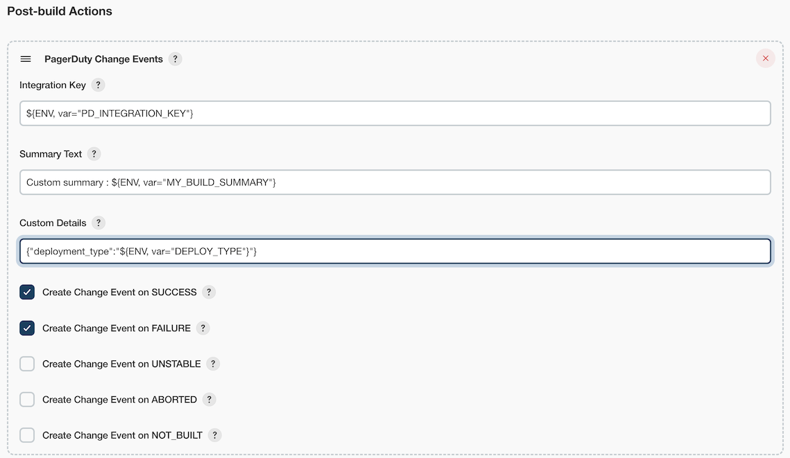
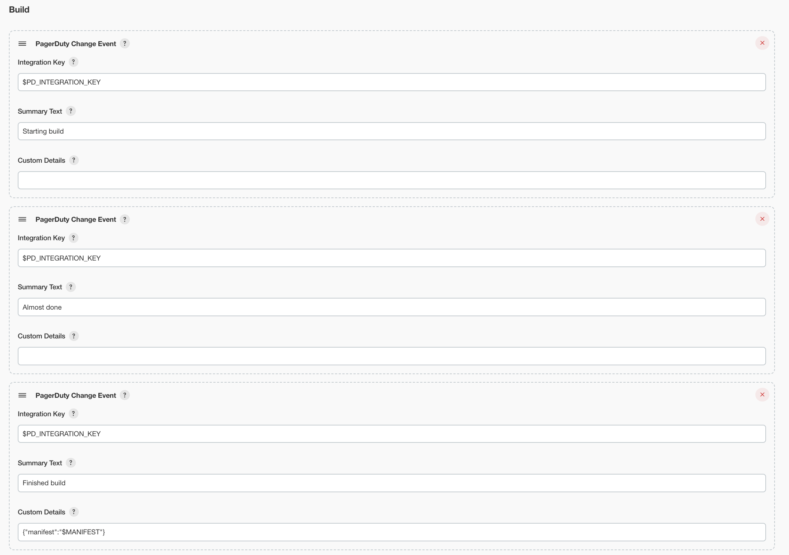

PagerDuty plugin
====================

[](https://gitter.im/jenkinsci/pagerduty-plugin?utm_source=badge&utm_medium=badge&utm_campaign=pr-badge)
[](https://plugins.jenkins.io/pagerduty)
[](https://github.com/jenkinsci/pagerduty-plugin/releases)
[](https://plugins.jenkins.io/pagerduty)


## About this plugin

Allows users to send **Change Events** and trigger postbuild **Incidents** via
[PagerDuty](https://www.pagerduty.com/)

#### Features

-   Support for PagerDuty [Change Events](https://support.pagerduty.com/docs/change-events) API
-   Trigger incidents on various job statuses
    Success/Failure/Aborted/Unstable/Not\_Built
-   Trigger incidents based on number of consecutive build results
-   Automatically **Resolve** incidents when job is **back to normal**
-   Pipeline compatible
-   TokenMacro consumer
    ([TokenMacro](https://plugins.jenkins.io/token-macro) -
    adds reusable macro expansion capability)

---

## Requirements

-   Jenkins version 1.580.1 or newer is required.
-   PagerDuty account (you can create a [free developer account
    here](https://signup.pagerduty.com/accounts/new))


## Usage

### Getting Started

Before you can use this plugin you'll need an **integration key** (also known as a **routing key**). This key tells PagerDuty which service the incoming event should be sent to. If you already have a service in PagerDuty you can [add an integration to it](https://support.pagerduty.com/docs/services-and-integrations#add-integrations-to-an-existing-service); otherwise, you can add the integration when [creating a new service](https://support.pagerduty.com/docs/services-and-integrations#create-a-new-service). For the integration type, choose "Jenkins CI".

Once you have an integration key you can add the appropriate action to your Jenkins project and supply it with the integration key. Be sure to select which job results you want to send an event to PagerDuty.

---
## IMPORTANT!


 **There is a beak in backwards compatibility between versions 4.x.x and 6.x.x**

 if you are migrating from earlier versions to 6.x.x and above note the following changes:

-    serviceKey is replaced with **routingKey**
-    incidentKey is replaced with **dedupKey**
-    incDescription/incDetails are replaced with **incidentSummary**
-    please note the new fields introduced starting version 6.x.x

---
### Pipeline

#### Trigger/Resolve Incidents

PLEASE NOTE -
routing key and integration key are the same thing!


```
pagerduty(resolve: false, routingKey: "$ROUTING_KEY [NOT NULL]", 
dedupKey:"$DEDUP_KEY", incidentSummary:"$INCIDENT_SUMMARY", 
incidentSource: "$INCIDENT_SOURCE", incidentSeverity:"$INCIDENT_SEVERITY",
incidentComponent:"$INCIDENT_COMPONENT", incidentGroup:"$INCIDENT_GROUP", incidentClass:"$INCIDENT_CLASS",
customDetails: [key1: "value1", ... , keyN: "valueN"])
```


if resolve == false, pagerduty triggers an incident and returns the
incidentKey

NOTE - To include Custom Details in the step, specify them via a Map as shown above.

#### Change Events

`pagerdutyChangeEvent(integrationKey: '$INTEGRATION_KEY')`

---
You can choose one (or both) of the options to use PagerDuty


### Trigger/Resolve Incidents

Using the "PagerDuty Incident Trigger" action, you can trigger or resolve incidents based on the results of a job.

NOTE - To include Custom Details in the trigger, specify them via a JSON string in the textbox




### Create Change Events

Using the "PagerDuty Change Events" action, you can create a [change event](https://support.pagerduty.com/docs/change-events) when a job completes.





### Create Change Events From A Freestyle Job

The configuration of a freestyle job allows for including PagerDuty
change events as build steps by passing the integration key and a
custom summary text field. If the summary text field is left blank,
the default description of the Jenkins build job and its build number
are used. Here's an example of a freestyle job configuration page:



The PagerDuty change event results of the above freestyle job are
shown below:


## Version History

#### Version 7.0.0 (Mar 31, 2021)
(thanks [Bryan Bishop](https://github.com/bjbishop) and [Adam Krapfl](https://github.com/akrapfl)!)
-   ChangeEvent custom summary text
-   Support for tokenized strings in ChangeEvent 
-   Freestyle job change events (Resolves JENKINS-64774 and #51)
-   Bug Fixes

#### Version 0.6.2 (Jan 03, 2021)
-   Documentation Fix
-   Bug Fixes (Resolves JENKINS-64485 and #43)

#### Version 0.6.1 (Dec 08, 2020)

-   Add **Change Events** support (thanks [Adam Vaughan](https://github.com/adamvaughan)!)
-   Bug fixes
-   Remove Jetty dependency from pom
-   Move docs to Github

#### Version 0.6.0 (Dec 06, 2020)
-   Add **Change Events** support (thanks [Adam Vaughan](https://github.com/adamvaughan)!)
-   Bug fixes
-   <<< **THIS VERSION BREAKS BACKWARDS COMPATIBILITY WITH EARLIER VERSIONS** >>>

#### Version 0.4.1 (Mar 12, 2019)

-   Add **TokenMacro** support
-   Bug fixes
-   Code refactor

#### Version 0.3.0 (Jan 31, 2017)

-   Pipeline compatible
-   Code refactor

#### Version 0.2.6 (June 20, 2017)

-   Bug fixes
-   PagerDuty v2 compatibility (migrating from
    [square](https://github.com/square/pagerduty-incidents) PD utility
    to [dikhan's](https://github.com/dikhan/pagerduty-client) PD client)

#### Version 0.2.5 (March 10, 2017)

-   Bug fixes

#### Version 0.2.4 (March 30, 2016)

-   Allow automatic resolution of the incident on ***BACK-TO-NORMAL***
    (from **not** success to **success**)

#### Version 0.2.3 (March 09, 2016)

-   Bug fixes

#### Version 0.2.2 (January 03, 2016)

-   Allow triggering alert in all job statuses
    (SUCCESS/FAILED/ABORTED/UNSTABLE/NOT\_BUILT)
-   Allow using multiple service keys for different job

#### Version 0.2.1 (December 08, 2015)

-   Allow using Environment Variables for config

#### Version 0.2.0 (September 26, 2015)

-   Initial public release

---

